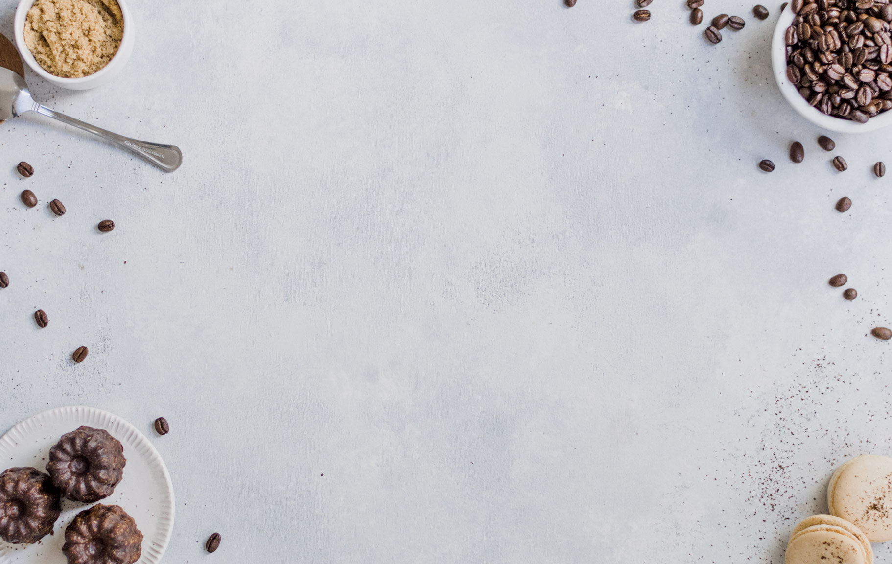

# Day 2 Cheatsheet

## Table of Contents
- [01-Linking](#01-linking)
- [02-Selectors](#02-selectors)
- [03-Box Model](#03-box-model)
- [04-Box Sizing](#04-box-sizing)
- [05-Sizing](#05-sizing)
- [06-Colors](#06-colors)
- [07-Text](#07-text)
- [08-Background Flex Grid Media Queries](#08-background-flex-grid-media-queries)

## 01 Linking
```html
<!DOCTYPE html>
<html lang="en">
<head>
  <meta charset="UTF-8">
  <meta http-equiv="X-UA-Compatible" content="IE=edge">
  <meta name="viewport" content="width=device-width, initial-scale=1.0">
  <title>CSS Training | Linking</title>

  <link rel="shortcut icon" href="./img/icon.png" type="image/x-icon">

  <link rel="stylesheet" href="./css/01-linking.css">

  <style>
    h2 {
      color: blue;
    }
  </style>
</head>
<body>

  <h1 style="color: darkseagreen !important;">Inline Style Attribute</h1>
  <h2>Internal Style Tag</h2>
  <h3>External Style Sheet</h3>

</body>
</html>
```

```css
h3 {
  color: olivedrab;
  font-family: sans-serif;
}

h2 {
  color: violet;
}

h1 {
  color: orange;
}

h1 {
  color: aquamarine !important;
}

h1 {
  color: goldenrod !important;
}
```

[Back to Top](#day-2-cheatsheet)

## 02 Selectors
```html
  <!-- #parent>.children#child${Child $$}*10 -->
  <div id="parent">
    <div class="children" id="child1">Child 01</div>
    <div class="children" id="child2">Child 02</div>
    <div class="children" id="child3">Child 03</div>
    <div class="children" id="child4">Child 04</div>
    <div class="children" id="child5">Child 05</div>
    <div class="children" id="child6">Child 06</div>
    <div class="children" id="child7">Child 07</div>
    <div class="children" id="child8">Child 08</div>
    <div class="children" id="child9">Child 09</div>
    <div class="children" id="child10">Child 10</div>
  </div>

  <!-- div>lorem8 -->
  <div>Lorem ipsum dolor sit amet consectetur adipisicing elit.</div>

  <!-- h${Heading $}*6 -->
  <h1>Heading 1</h1>
  <h2>Heading 2</h2>
  <h3>Heading 3</h3>
  <h4>Heading 4</h4>
  <h5>Heading 5</h5>
  <h6>Heading 6</h6>

  <!-- ul>li*5>a[href="#"]{Head Link $}+ol>li*5>a[href="#"]{Sublink} -->

  <ul>

    <label for="adjacent">Adjacent Sibling Selector</label>
    <input type="checkbox" name="" id="adjacent">
    <li>
      <a href="#">Head Link 1</a>
      <ol>
        <li><a href="#">Sublink</a></li>
        <li><a href="#">Sublink</a></li>
        <li><a href="#">Sublink</a></li>
        <li><a href="#">Sublink</a></li>
        <li><a href="#">Sublink</a></li>
      </ol>
    </li>

    <label for="general">General Sibling Selector</label>
    <input type="checkbox" name="" id="general">
    <li>
      <a href="#">Head Link 2</a>
      <ol>
        <li><a href="#">Sublink</a></li>
        <li><a href="#">Sublink</a></li>
        <li><a href="#">Sublink</a></li>
        <li><a href="#">Sublink</a></li>
        <li><a href="#">Sublink</a></li>
      </ol>
    </li>
    <li>
      <a href="#">Head Link 3</a>
      <ol>
        <li><a href="#">Sublink</a></li>
        <li><a href="#">Sublink</a></li>
        <li><a href="#">Sublink</a></li>
        <li><a href="#">Sublink</a></li>
        <li><a href="#">Sublink</a></li>
      </ol>
    </li>
    <li>
      <a href="#">Head Link 4</a>
      <ol>
        <li><a href="#">Sublink</a></li>
        <li><a href="#">Sublink</a></li>
        <li><a href="#">Sublink</a></li>
        <li><a href="#">Sublink</a></li>
        <li><a href="#">Sublink</a></li>
      </ol>
    </li>
    <li>
      <a href="#">Head Link 5</a>
      <ol>
        <li><a href="#">Sublink</a></li>
        <li><a href="#">Sublink</a></li>
        <li><a href="#">Sublink</a></li>
        <li><a href="#">Sublink</a></li>
        <li><a href="#">Sublink</a></li>
      </ol>
    </li>
  </ul>

  <h2 title="Manual Lorem">Lorem ipsum, dolor sit amet consectetur adipisicing elit.</h2>

  <!-- h2[title="Emmet Lorem"]>lorem8 -->
  <h2 title="Emmet Lorem">Lorem, ipsum dolor sit amet consectetur adipisicing elit.</h2>

  <a href="https://www.binance.com/" target="_blank" rel="noopener noreferrer">Binance</a>
  <a href="https://www.coingecko.com/" target="_blank" rel="noopener noreferrer">Coin Gecko</a>
```

```css
/* CTRL + SPACE = Trigger Suggest */

/* Selector Specificity */
/* #id | .class | element */

/* element */
body {
  font-family: sans-serif;
  font-size: 20px;
  margin-bottom: 500px;
}

div {
  color: teal;
}

/* .class */
.children {
  color: darkorange;
}

/* #id */
#child10 {
  color: darkslateblue;
}

/* element.class */
div.children {
  color: dodgerblue;
}

/* element#id */
div#child10 {
  color: darksalmon;
}

/* .class#id */
.children#child9 {
  color: hotpink;
}

/* element.class#id */
div.children#child10 {
  color: forestgreen;
}

/* Multi-Selector = , */
h1,h2,h3,h4,h5,h6 {font-weight: normal;}

/* Combinators */
/* Space = Descendant Selector */
ul a {
  text-decoration: none;
  color: lightcoral;
}

/* * = Wildcard Selector */
ul * {
  font-style: italic;
}

/* > = Direct Child Selector */
ul > li {
  list-style-type: none;
}

ul > li > a {
  color: navy;
}

/* [] = Attribute Selector */
[title] {
  color: crimson;
}

[title="Emmet Lorem"] {
  color: lightskyblue;
}

/* ::Pseudo Elements */
::selection{
  background-color: darkslategrey;
  color: white;
}

h1::before {content:'🙆🏻‍♂️';}
h1::after {content:'🙆🏻';}
ul > li::marker {content: '👱🏻‍♂️';}

/* :Pseudo Class */
a:hover {color: goldenrod;}
a:visited {color: chocolate;}
a:active {color: lightsalmon;}
a:focus {outline: 3px solid plum;}
:checked {accent-color: rebeccapurple;}

/* + = Adjacent Sibling Selector */
#adjacent:checked + li {display: none;}

/* ~ = General Sibling Selector */
#general:checked ~ li {display: none;}

```

[Back to Top](#day-2-cheatsheet)

## 03 Box Model
```html
  <!-- .container>.box#box$*3>h2{Border}+p{Is the Space your Element} -->
    <section>

    <article class="box" id="box1">
      <h2>Margin</h2>
      <p>Is the Space Outside your Element</p>
    </article>

    <article class="box" id="box2">
      <h2>Border</h2>
      <p>Is the Space Outlining your Element</p>
    </article>

    <article class="box" id="box3">
      <h2>Padding</h2>
      <p>Is the Space Inside your Element</p>
    </article>

  </section>
```

```css
body, h2, p {margin: 0;}

article {
  /* Shorthand = Width | Style | Color */
  /* border: 10px solid mediumpurple; */

  border-width: 10px;
  border-style: solid;
  border-color: mediumpurple;

  /* Shorthand TL | TR | BR | BL */
  border-radius: 20px 0 0 0;

  /* border-top: 10px solid mediumpurple; */
  /* border-right: 10px solid mediumpurple; */
  /* border-bottom: 10px solid mediumpurple; */
  /* border-left: 10px solid mediumpurple; */
  
  /* 4 Values = Top | Right | Bottom | Left */
  /* margin: 50px; */
  /* margin: 50px 20px 50px 20px; */

  /* 3 Values = Top | Left&Right | Bottom */
  /* margin: 50px 20px 50px; */

  /* 2 Values = Top&Bottom | Left&Right */
  /* margin: 50px 20px; */

  margin-top: 50px;
  margin-right: 20px;
  margin-bottom: 50px;
  margin-left: 20px;
  
  /* Logical Properties */

  /* Top&Bottom */
  margin-block: 50px;

  /* Left&Right */
  margin-inline: 20px;

  /* 4 Values = Top | Right | Bottom | Left */
  /* padding: 50px; */
  /* padding: 50px 20px 50px 20px; */

  /* 3 Values = Top | Left&Right | Bottom */
  /* padding: 50px 20px 50px; */

  /* 2 Values = Top&Bottom | Left&Right */
  /* padding: 50px 20px; */

  padding-top: 50px;
  padding-right: 20px;
  padding-bottom: 50px;
  padding-left: 20px;
  
  /* Logical Properties */

  /* Top&Bottom */
  padding-block: 50px;

  /* Left&Right */
  padding-inline: 20px;
}

h2 {
  /* bd10-s-khaki+m10+p10 */
  border: 10px solid khaki;
  margin: 10px;
  padding: 10px;
}

p {
  /* bd10-s-khaki+m10+p10 */
  border: 10px dotted dodgerblue;
  margin: 10px;
  padding: 10px;
}

.container {
  display: flex;
  justify-content: center;
}
```

[Back to Top](#day-2-cheatsheet)

## 04 Box Sizing
```html
  <div class="content-box">Content Box</div>
  <div class="space"></div>
  <div class="border-box">Border Box</div>
```

```css
html {box-sizing: border-box;}
*, *::before, *::after {box-sizing: inherit;}

/* Styling */
body {
  background-color: #efefef;
  color: white;
  font-family: sans-serif;
  font-size: 20px;
}
.space {
  width: 400px;
  height: 50px;
  background-color: lightgray;
}
.content-box {
  width: 400px;
  background-color: skyblue;
  padding: 20px;
  border: 10px solid goldenrod;
  box-sizing: content-box;
}
.border-box {
  width: 400px;
  background-color: skyblue;
  padding: 20px;
  border: 10px solid springgreen;
}


```

[Back to Top](#day-2-cheatsheet)

## 05 Sizing
```html
  <!-- .parent>.children#child${Child $}*3 -->
  <div class="parent">
    <div class="children" id="child1">Child 1</div>
    <div class="children" id="child2">Child 2</div>
    <div class="children" id="child3">
      000000000000000000000000000000
      000000000000000000000000000000
      000000000000000000000000000000
      000000000000000000000000000000
      000000000000000000000000000000
      000000000000000000000000000000
      000000000000000000000000000000
      000000000000000000000000000000
      000000000000000000000000000000
      000000000000000000000000000000
      000000000000000000000000000000
      000000000000000000000000000000
      000000000000000000000000000000
      000000000000000000000000000000
      000000000000000000000000000000
    </div>
  </div>
```

```css
html {
  box-sizing: border-box;
  height: 100%;
}

body {
  height: inherit;
}

*, *::before, *::after {box-sizing: inherit;}

/* Width & Height | Default is 100% & auto */
/* Pixels = px */
.parent {
  border: 10px solid purple;
  margin-inline: auto;

  /* Clamp clamp(min, ideal, max) */
  width: clamp(450px, calc(2.5rem + 39vw), 800px);

  /* Min = To Prevent Undersizing */
  /* min-width: 450px; */

  /* width: calc(2.5rem + 39vw); */ /* 31.25rem */ /* 39vw */ 

  /* Max = To Prevent Oversizing */
  /* max-width: 800px; */

  height: 500px;/* 31.25rem */
  font-size: 20px;/* 1.25rem */
}

/* Percentage = % According to the Parent*/
#child1 {
  background-color: goldenrod;
  width: 50%;
  height: 50%;
}

/* vh & vw = Viewport Height & Viewport Width */
#child2 {
  background-color: aqua;
  width: 50vw;
  height: 50vh;
  font-size: 3em;
  /* em = Font Size According to Parent */
}

/* ch = 0 Character From Current Font Size */
#child3 {
  background-color: coral;
  width: 30ch;
  height: 30ch;
  line-height: 1.5em;
  font-size: 3rem;
  /* writing-mode: vertical-rl; */
  /* rem = Font Size According Root Font Size */
}
```

[Back to Top](#day-2-cheatsheet)

## 06 Colors
```html
  <!-- #parent>div{$$}*5 -->
  <div id="parent">
    <div>01</div>
    <div>02</div>
    <div>03</div>
    <div>04</div>
    <div>05</div>
  </div>
```

```css
html {
  box-sizing: border-box;
  width: 100%;
  height: 100%;

  /* CSS HEXA | RR GG BB AA */
  /* CSS RGBA | 255 255 255 0.5 */
  /* CSS Hue Saturation Lightness | 360 100% 100% 0.5 */
  /* --hex:rgba(0, 0, 255, 0.502); */

  --black: #3d3b30ff;
  --primary: #5c80bcff;
  --secondary: #4d5061ff;
  --white: #e9eddeff;
  --accent: #c5e6a6ff;
  --accent-hover: hsl(91, 56%, 58%);
}

*, *::before, *::after {box-sizing: inherit;}
body,h1,h2,h3,h4,h5,h6,p{margin: 0;}

body {
  width: inherit;
  height: inherit;
}

#parent {
  width: inherit;
  height: inherit;
}

#parent > * {
  width: 20%;
  height: 20%;
}

#parent,
#parent > * {
  width: inherit;
  display: grid;
  grid-auto-flow: column;
  place-items: center;
  font-family: sans-serif;
  font-size: 50px;
}

/* coolors.co */

#parent > :nth-child(1) {background-color: var(--white);}
#parent > :nth-child(2) {background-color: var(--black);}
#parent > :nth-child(3) {background-color: var(--primary);}
#parent > :nth-child(4) {background-color: var(--secondary);}

/* Transition */
#parent > :nth-child(5) {
  background-color: var(--accent);
  opacity: 50%;
  transition:
  background-color 373ms,
  transform 350ms,
  opacity 350ms;
}

/* transform: scale | translate | skew | rotate */
#parent > :nth-child(5):hover {
  background-color: var(--accent-hover);
  transform: scale(150%, 150%);
  opacity: 100%;
}

/* angrytools.com/css/animation */

/* Animation */
#parent > :nth-child(1),
#parent > :nth-child(2),
#parent > :nth-child(3),
#parent > :nth-child(4),
#parent > :nth-child(5) {
  /* Long Hand */
  animation-name: fade-in-top;
  animation-duration: 1s;
  animation-timing-function: ease;
  animation-delay: 0s;
  animation-iteration-count: 1;
  animation-direction: normal;
  animation-fill-mode: backwards;

  /* Shorthand */
  /* animation: name duration timing-function delay iteration-count direction fill-mode; */
  /* animation: fade-in-top 1s ease 0s 1 normal none; */
}

#parent > :nth-child(2) {animation-delay: 1s;}
#parent > :nth-child(3) {animation-delay: 2s;}
#parent > :nth-child(4) {animation-delay: 3s;}
#parent > :nth-child(5) {animation-delay: 4s;}

@keyframes fade-in-top {
  0%{
    transform: translateY(-50px);
    opacity: 0;
  }
  100%{
    transform: translateY(0);
    opacity: 1;
  }
}
```

[Back to Top](#day-2-cheatsheet)

## 07 Text
```html
  <!-- div>h${Heading $}*6+p>lorem20 -->
  <div>
    <h1>Heading 1</h1>
    <h2>Heading 2</h2>
    <h3>Heading 3</h3>
    <h4>Heading 4</h4>
    <h5>Heading 5</h5>
    <h6>Heading 6</h6>
    <p>Lorem ipsum dolor sit, amet consectetur adipisicing elit. Aliquid error ea, atque exercitationem minima nesciunt quisquam neque in reiciendis cupiditate.</p>
    
    <!-- ol>li{List Item}*5 -->
    <ol>
      <li>List Item</li>
      <li>List Item</li>
      <li>List Item</li>
      <li>List Item</li>
      <li>List Item</li>
    </ol>
    
    <ul>
      <li>List Item</li>
      <li>List Item</li>
      <li>List Item</li>
      <li>List Item</li>
      <li>List Item</li>
    </ul>
    
    <a href="#">Buy</a>
    <a href="#">View</a>
  </div>
```

```css
html {
  box-sizing: border-box;
  height: 100%;
  width: 100%;
  
  /* CSS HEX */
  --black: #0B0A07;
  --primary: #00635c;
  --secondary: #587792ff;
  --white: #8db1abff;
  --accent: #CBEF43;
  --accent-hover: hsl(73, 84%, 40%);

  --ff-head: 'Lato', sans-serif;
  --ff-body: 'Roboto', sans-serif;

  --step--2: clamp(0.69rem, calc(0.66rem + 0.18vw), 0.80rem);
  --step--1: clamp(0.83rem, calc(0.78rem + 0.28vw), 1.00rem);
  --step-0: clamp(1.00rem, calc(0.92rem + 0.42vw), 1.25rem);
  --step-1: clamp(1.20rem, calc(1.08rem + 0.60vw), 1.56rem);
  --step-2: clamp(1.44rem, calc(1.27rem + 0.86vw), 1.95rem);
  --step-3: clamp(1.73rem, calc(1.49rem + 1.19vw), 2.44rem);
  --step-4: clamp(2.07rem, calc(1.75rem + 1.63vw), 3.05rem);
  --step-5: clamp(2.49rem, calc(2.05rem + 2.21vw), 3.82rem);
}

*, *::before, *::after{box-sizing: inherit;}

body {
  height: inherit;
  width: inherit;
}

body,h1,h2,h3,h4,h5,h6,p{margin: 0;}

h1,h2,h3,h4,h5,h6,a {font-family: var(--ff-head);}

p, ul, ol {font-family: var(--ff-body);}

/* 320px 16px 1280px 20px */
h1 {font-size: var(--step-5);}
h2 {font-size: var(--step-4);}
h3 {font-size: var(--step-3);}
h4 {font-size: var(--step-2);}
h5 {font-size: var(--step-1);}
h6 {font-size: var(--step-0);}
p, ul, ol, a{font-size: var(--step-0);}

div {
  width: 400px;
  border: 3px solid #bbb;
  padding: 20px 25px;
  margin: 50px auto;
  /* left | center | right | justify */
  text-align: center;
  box-shadow:
  inset 0 0 0 5px var(--secondary),
  inset 0 0 0 10px var(--primary),
  inset 0 0 0 15px var(--white);
}

h1,h2,h3,h4,h5,h6,a {
  font-weight: 900;
  letter-spacing: 2px;
  /* uppercase | lowercase | capitalize */
  text-transform: uppercase;
  color: var(--primary);
  text-shadow: 5px 3px 0 #00635c75;
}

p, ul, ol {
  line-height: 1.5;
  word-spacing: 1px;
  text-align: left;
  color: var(--secondary);
}

/* none | lower-roman | upper-roman */
/* lower-greek | lower-alpha | upper-alpha */
ol {
  list-style-type: lower-greek;
}

/* none | disc | circle | square */
ul {
  list-style-type: square;
}

/* none | underline | overline | line-through */
a {
  text-decoration: none;
  text-shadow: none;
  color: var(--black);
  background-color: var(--white);
  padding: 5px 10px;
  margin: 10px 0;
  display: inline-block;
  transition: transform 300ms;
}

/* transform = translate | scale | rotate | skew */
/* translate = movement (x hoff, y voff) */
a:hover {
  transform: translate(0, -10px);
}
```

[Back to Top](#day-2-cheatsheet)

## 08 Background Flex Grid Media Queries
```html
  <section>
    
    
    
    <h1>Background Sample</h1>
    <video src="./video/boots.mp4" width="450" autoplay muted loop></video>
    <!--  -->
    <!-- <iframe id="ytplayer" type="text/html" width="1920" height="1080" src="https://www.youtube.com/embed/DSKOg3KpTic?autoplay=1&mute=1&controls=0&disablekb=1&enablejsapi=1&fs=0&loop=1&modestbranding=1&color=white" frameborder="0" allowfullscreen> -->
    <a href="#">Shop</a>
  </section>
```

```css
/* #region Styling */
section {
  border: 1px solid #000;
  width: 100%;
  height: 60%;

  background-color: #8db1ab80;
  /* background-image: url(../img/bg-image.jpg); */
  /* background-image: url(//unsplash.it/450/); */
  /* background-image: url(https://c.tenor.com/ZFPKlHHJ-FMAAAAd/internet-wow.gif); */

  background-repeat: no-repeat;
  background-position: center;

  /* contain | cover */
  background-size: cover;

  /* static */
  position: relative;
  /* top: 20px; */
  /* right: 20px; */
  /* bottom: 20px; */
  /* left: 20px; */
  text-align: center;

  /* Display Properties */
  /* Block | Inline | Table | None | Inline-Block | Flex | Grid */

  /* Flexbox Code */
  /* display: flex; */

  /* space-around | space-between | space-evenly */
  /* justify-content: space-evenly; */
  /* align-items: center; */

  /* no-wrap | wrap */
  /* flex-wrap: wrap; */

  /* row | column | row-reverse | column-reverse */
  /* flex-direction: column; */

  /* Grid Code */
  display: grid;
  /* grid-auto-flow: column; */
  grid:
  "  .    .   .  " 1fr
  "  .   logo .  " 1fr
  "  .    h1  .  "
  "  .    a   .  "
  "  .    .   .  " 1fr
  / 1fr   1fr 1fr;
  place-items: center;
}

/* order is applied to children */

section > video {
  /* grid-row-start | grid-column-start | grid-row-end | grid-column-end*/
  grid-area: 1 / 1 / -1 / -1;
  width: 100%;
  height: 100%;
  /* position: absolute; */
  /* top: 0; */
  object-fit: cover;
  z-index: -1;
  /* order:1; */
}

section > a {
  grid-area: a;
  /* position: fixed; */
  /* bottom: 30px; */
  /* right: 30px; */
  /* order:3; */
}

section > h1 {
  grid-area: h1;
  color: var(--black);
  /* order:2; */
}

img[src*="desktop"] {
  opacity: 0;
}

img[src*="mobile"],
img[src*="desktop"] {
  grid-area: logo;
  transition: opacity 350ms;
}

/* #endregion Styling */

/* #region Media Queries */
/* 👈🏻 Desktop first media query = (max-width:px) */
@media only screen and (max-width:768px) {
  /* section {
    height: 40%;
  } */

}

/* 👉🏼 Mobile first media query = (min-width:px) */
@media only screen and (min-width:768px) {
  section{
    height: 100%;
    grid:
    "  logo .   .  " 1fr
    "  .    h1  .  "
    "  .    a   .  "
    "  .    .   .  " 1fr
    / 1fr   1fr 1fr;
  }

  img[src*="mobile"] {
    opacity: 0;
  }
  
  img[src*="desktop"] {
    opacity: 100%;
    place-self: start;
  }
}
/* #endregion Media Queries */
```